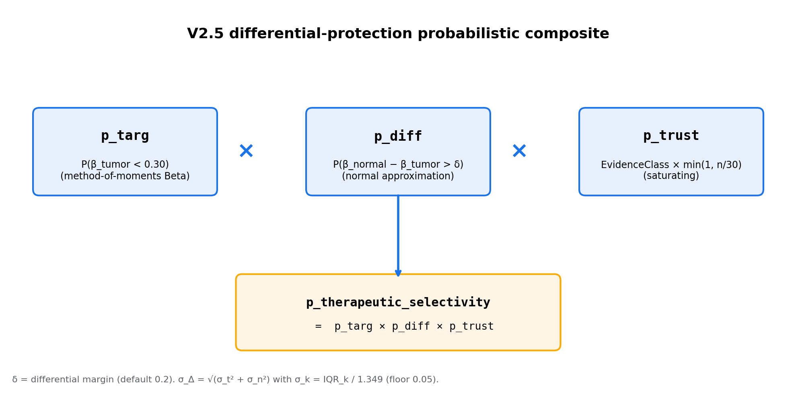
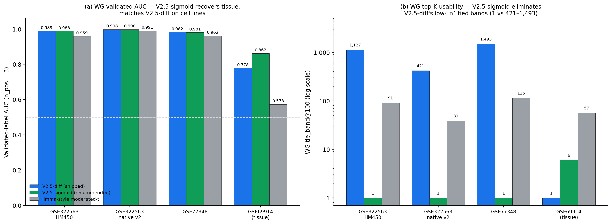
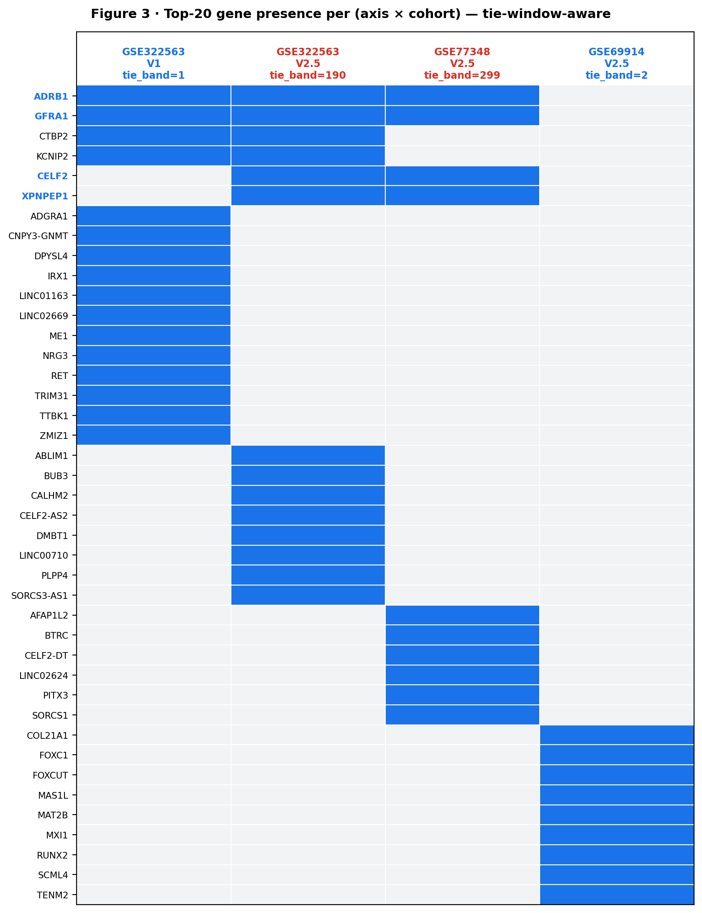

# Differential-protection probabilistic scoring for methylome-guided ThermoCas9 target-site ranking

**Author.** Allison Huang, Columbia University. Contact: <allisonhmercer@gmail.com>.
**Date.** 2026-04-22.
**Code.** <https://github.com/AllisonH12/thermocas9> at tag `memo-2026-04-22-v` (immutable pointer to the exact revision that produced this paper).
**Status.** Educational research framework. Not peer-reviewed. No clinical claims. Cites Roth et al., *Nature* (2026), DOI [10.1038/s41586-026-10384-z](https://doi.org/10.1038/s41586-026-10384-z).

---

## Abstract

Methylation-sensitive Cas9 variants target genomic loci that are
hypomethylated in disease cells and methylated in matched normal
cells. Selecting such loci from genome-scale array data is a ranking
problem whose scoring axis must be cohort-agnostic and must report
its own uncertainty. A first-pass probabilistic composite
`p_targ × p_prot × p_trust` failed empirically — `p_prot` encoded
a static "normal is methylated above 0.5" assumption that is
anti-predictive on bulk normal comparators (AUC 0.38). We replace it
with a differential factor `p_diff = P(β_normal − β_tumor > δ)` under
an independent-normal approximation on per-probe summaries.

This paper is a **scoring-method and benchmarking** contribution, not
a target-discovery validation. The headline result is a *rank-lift*
finding on a small label set: on the n = 3 validated target probes
from Roth et al. (2026) Fig. 5d, scored on Roth's own MCF-7/MCF-10A
EPIC v2 cohort (GSE322563), the new composite (V2.5) places all
three positives near the top of the ranking (AUC 0.990) while the
deterministic V1 score reaches 0.821 and the deprecated V2
`tumor_only` mode 0.928. Because n = 3, AUC is sensitive to the
exact negative universe and to the rank of each positive; the
manuscript reports per-positive ranks and percentile ranks
(§5.1) rather than treating AUC as definitive. A second matched
MCF-7/MCF-10A cohort (GSE77348) is the development cohort on which
the differential margin δ was tuned and is reported as supporting
evidence, not as an independent confirmation. Every benchmark
result emits `tie_band_size_at_k` and `precision_at_k_{min,max}` so
that low-replicate top-K numbers are reported as adversarial
intervals, not point estimates; on n = 2/2 cohorts, V2.5 should be
read as identifying a *top tied candidate class* rather than a
ranked top-20. A separate cross-series run at the Sanger GDSC breast
panel is documented as an out-of-distribution label-transport
boundary case, not a generalization test, because Sanger's MCF-7 is
methylated at the sites where Roth's MCF-7 is unmethylated. V1
remains the stable-release default; V2.5 is the recommended
probabilistic ranking axis on every non-boundary cohort shape
tested (matched cell-line at n = 2/2 and 3/3, and primary tissue
at n = 305/50 — §5.1–§5.3), with the caveat that on n = 2/2
cell-line cohorts the visible top-K should be read as a top tied
candidate class rather than a ranked shortlist (§6.1); all code
and benchmark artifacts are public.

---

## 1 · Background

### 1.1 ThermoCas9 is methylation-sensitive at the PAM

Roth et al. (2026) characterized *Geobacillus thermodenitrificans* T12
Cas9 (ThermoCas9) biochemically, structurally, and in human
cell-line editing assays. The central result: cleavage efficiency is
governed by the methylation state of the fifth position of the PAM
(`5'-NNNN`**`C`**`GA-3'` or `5'-NNNN`**`C`**`CA-3'`), not by
methylation within the protospacer. Methylated 5-methylcytosine (5mC)
at the PAM abolishes binding; unmethylated PAMs are cleaved as usual.
Cryo-EM structures at 2.2–2.8 Å resolved the protein contacts that
discriminate methylated from unmethylated cytosine.

The practical consequence is that ThermoCas9 gives a natural
mechanism to selectively edit in cells where a target locus is
hypomethylated while sparing cells where the same locus is methylated.
Roth demonstrated this in MCF-7 vs. MCF-10A at three breast-cancer
loci: *EGFLAM* (control locus included in the validated target set),
*ESR1*, and *GATA3*. The underlying
methylation of the PAM cytosine at those loci was profiled on the
Illumina Infinium MethylationEPIC v2 array and reported in
Supplementary Figure 5d of the main paper alongside the editing
results.

### 1.2 Target-site selection is a ranking problem

Given a reference genome, the ThermoCas9-compatible PAM sites on any
chromosome number in the millions. To pick candidates for wet-lab
follow-up, one wants a ranked list where the top scorers are
*biologically coherent* — meaning the candidate's PAM cytosine is
unmethylated in the disease cohort and methylated in the matched
normal — *and* where the confidence of the underlying methylation
measurement is part of the score. This is a classical
ranking-with-covariates problem, and the natural scoring target is
some decomposition of a probability of "therapeutic selectivity."

This paper describes the specific decomposition we ended up using
after two earlier attempts failed on empirical cohorts.

### 1.3 Notation

For one candidate site on one cohort we carry six per-probe β
summary statistics from the cohort's methylation array
(`β_tumor_mean`, `β_tumor_q25`, `β_tumor_q75`, `β_normal_mean`,
`β_normal_q25`, `β_normal_q75`), per-side sample counts (`n_tumor`,
`n_normal`), and an `EvidenceClass` capturing the distance between
the candidate's PAM cytosine and the nearest assayed CpG probe
(`EXACT`/`PROXIMAL_CLOSE`/`PROXIMAL`/`REGIONAL`/`UNOBSERVED`) — nine
inputs in total per candidate × cohort pair.

---

## 2 · The V2 misspecification

### 2.1 First-pass composite

The first-pass composite followed a standard decomposition:

```
p_therapeutic_selectivity = p_targ × p_prot × p_trust
```

- `p_targ = P(β_tumor < 0.30)` — probability that the tumor's PAM cytosine is unmethylated enough for ThermoCas9 to cleave. Estimated via a method-of-moments Beta fit to `(mean, IQR/1.349)` with the regularized incomplete beta computed in pure stdlib via Lentz's continued fraction; falls back to a piecewise-linear CDF when the Beta moments are ill-defined.
- `p_prot = P(β_normal > 0.50)` — probability that the normal's PAM cytosine is methylated enough to protect the normal cell.
- `p_trust` — confidence factor that scales with `EvidenceClass` (0.95 at EXACT, 0.15 at REGIONAL, 0.0 at UNOBSERVED) and saturates linearly in `min(n_tumor, n_normal)` up to `ramp_n = 30`.

### 2.2 Empirical failure of `p_prot`

We ran a factor ablation on a structural surrogate for the Roth
MCF-7 vs. MCF-10A comparison: GEO series GSE77348, an independent 2016
breast cell-line methylation series on HM450 (not the Roth samples).
With 1,687 gene-region-filtered "positives" at the Roth genes, the
measured AUCs were:

| axis | AUC (loose) | AUC (tight) |
|---|---:|---:|
| `v2_tumor_only` (p_targ × p_trust) | 0.733 | 0.770 |
| `p_targ` alone | 0.683 | 0.717 |
| V1 `final_score` | 0.657 | 0.628 |
| `naive_selectivity` (β_n − β_t) | 0.608 | 0.571 |
| `p_targ × p_prot` | 0.503 | 0.488 |
| **`p_prot` alone** | **0.384** | **0.343** |

`p_prot` is anti-predictive. Multiplying it against `p_targ` destroys
the signal. The cause is the semantics: `P(β_normal > 0.5)` assumes
that the normal comparator *methylates the target*. That assumption
holds for Roth's specific MCF-10A cell line at the three *ESR1* /
*GATA3* / *EGFLAM* probes they chose to validate (genes that are
silenced in non-tumorigenic mammary epithelium) but does not generalize
to bulk adjacent-normal cohorts or even to MCF-10A at gene-body probes.

### 2.3 V2.4 — keep the composite, drop `p_prot` by default

The intermediate fix kept the composite but allowed users to opt in
or out of the anti-predictive factor. Default changed to
`tumor_only` = `p_targ × p_trust`. This improved global AUC but the
top-100 collapsed onto "always-unmethylated" loci (candidates where
both tumor *and* normal are low-methylated) — good AUC, unusable for
target discovery. The deeper fix was needed.

---

## 3 · V2.5 · differential-protection probabilistic mode



**Figure 1.** The V2.5 composite. Three factors multiply: `p_targ`
(tumor unmethylated at the PAM cytosine), `p_diff` (differential
methylation gap exceeds δ under a normal approximation on per-probe
β summaries), and `p_trust` (evidence-class confidence, saturating
in min sample count). The result is `p_therapeutic_selectivity`,
the stored scalar that downstream ranking consumes. The deprecated
V2 `p_prot = P(β_normal > 0.5)` is replaced by `p_diff` to remove
its static-threshold assumption about the normal side.

### 3.1 Formulation

Replace the threshold-based `p_prot` with a differential factor:

```
p_diff(δ) = P(β_normal − β_tumor > δ)
```

estimated under an independent-normal approximation:

```
σ_k   ≈ IQR_k / 1.349                 (k ∈ {tumor, normal}; floor at 0.05)
σ_Δ²  = max(σ_t, floor)² + max(σ_n, floor)²
z     = (δ − (μ_n − μ_t)) / σ_Δ
p_diff = 1 − Φ(z) = 0.5 (1 − erf(z / √2))
```

with `Φ` the standard normal CDF. The composite becomes:

```
p_therapeutic_selectivity = p_targ × p_diff × p_trust
```

This makes no absolute-threshold claim about the normal side. It asks
only what fraction of normal-vs-tumor β pairs sampled from the
per-side empirical distributions would exceed δ, under independent
normal approximations to those per-side distributions. (This is a
*population-overlap* statistic, not a confidence interval on a
cohort-level mean contrast — see §3.3.)

### 3.2 Choice of δ

An offline δ sweep over {0.2, 0.3, 0.4, 0.5} on the GSE77348 surrogate
selected δ = 0.2 by joint optimization of AUC and `P@100` against the
*pre-repair* (gene-universe) positives that were in use at the time
of selection. Under that pre-repair tuning objective, larger δ values
monotonically reduced both metrics — the factor was too strict to
admit candidates with moderate but real differentials.

The post-repair sensitivity story is more nuanced and is reported in
§5.3.2: against the Roth-validated label set, δ = 0.3 (and on some
cohort × tier rows, δ = 0.4) marginally outperforms δ = 0.2 on the
matched cell-line cohorts; tissue (GSE69914) prefers smaller δ.
We do not retune δ post hoc against the post-repair labels, because
doing so would invalidate the dev-cohort separation discipline of
§4.0. δ = 0.2 is therefore retained as the shipped default; readers
wanting the full sensitivity surface should consult §5.3.2.

The default is exposed as `differential_delta` in the cohort
configuration. The δ used is recorded on every emitted
`ProbabilisticScore` record so the margin in effect is recoverable
from a single output row.

### 3.3 What `p_diff` is a probability over

`p_diff(δ) = P(β_normal − β_tumor > δ)` is a probability under the
*biological β-heterogeneity* implied by per-cohort, per-probe
quartiles — not a posterior probability of editing efficacy and not
a confidence interval on a cohort-level mean contrast. The
distribution being integrated is the one that would generate
single-sample β values from a tumor-side population with quartiles
(`β_tumor_q25`, `β_tumor_q75`) and a normal-side population with
quartiles (`β_normal_q25`, `β_normal_q75`), under independent normal
approximations on each side. Two consequences follow:

1. **The variance does not shrink with sample size.** Because the
   per-side σ is the IQR-derived population dispersion, not the
   standard error of a mean, `p_diff` does not become more confident
   as `n_tumor`/`n_normal` grow. The growing-`n` story for the
   composite is carried by `p_trust` (saturating at `n ≳ 30`), not
   by `p_diff` tightening.
2. **`p_diff` is therefore a population-overlap statistic, not a
   significance test.** It answers "what fraction of tumor-vs-normal
   β-pairs sampled from the cohort would exceed δ?" An alternative
   formulation that scales σ with `n` (e.g. SE on the mean
   difference, or a hierarchical model on per-side variance) would
   also be defensible and would give a different — and at low `n`,
   a much wider — distribution. We use the population-overlap form
   because (a) the comparison the user cares about for site
   selection is biological — "is this site differentially
   methylated *between cells*?" — not "does this cohort have enough
   power to call this site significant?"; and (b) the small-`n`
   power question is already absorbed by `p_trust`. Re-deriving the
   composite under an SE-on-mean variant is a documented future
   axis (§6.3).

This is a deliberate modeling choice and is the single most
common point of confusion when reading `p_diff` cold.

### 3.4 Why a normal approximation instead of a difference-of-Betas

A proper Bayesian treatment would model β-values as Beta distributions
and compute the exact difference distribution numerically. For the
IQR ranges seen on HM450 / EPIC v2 arrays (~0.05–0.20), the normal
approximation is close to the correct answer and has the advantage of
being a two-line stdlib closed form. A σ floor of 0.05 prevents σ_Δ
from collapsing to zero at boundary β-values (very common for CpG
islands methylated at 0 or 1). These tradeoffs are documented in the
code; a downstream user who wants the exact difference-of-Betas path
can swap it in.

The normal approximation is operationally adequate for the
*ranking* use case but is not a calibrated probability of editing
success. Two situations where the approximation is poor on its own
terms but does not corrupt the ranking:

- **Boundary-β pile-ups.** β-distributions at CpG islands often
  pile up near 0 or 1; a single-mode normal centered at the
  per-side mean overstates symmetry and understates skew. The σ
  floor blunts the worst case (σ_Δ → 0) but does not restore the
  correct shape.
- **Bimodality across samples.** When tumor or normal samples carry
  two β sub-populations (e.g. methylation-class heterogeneity in
  primary tissue), the IQR-derived σ averages the two modes; the
  per-side normal then sits between the modes rather than on
  either. `p_diff` in this regime under-states the true population
  overlap.

Neither failure mode is silent: the §5.5 annotation pipeline
flags candidates whose per-side β quartiles indicate strong
bimodality. A future axis based on the exact difference-of-Betas
or a two-component mixture would address both.

### 3.5 The low-`n` tied-band prediction

With the new factor isolated, we can predict before running any new
cohort. `p_trust` is `EvidenceClass.base × min(1, min(n_t, n_n) / 30)`:
piecewise-linear in min sample count up to `ramp_n = 30`, then a
constant ceiling per evidence class. It is **never** continuous-valued
in the real-line sense — at n ≥ 30 it saturates to a discrete-by-
EvidenceClass value (0.95 at EXACT, 0.75 at PROXIMAL_CLOSE, etc.).
What changes between the low-`n` and high-`n` regimes is which factor
*dominates* the composite ordering:

- **Low n (n ≪ 30).** `p_trust` scales every same-evidence-class
  candidate by the same uniform fraction `(n / 30)`. Per-side IQRs are
  wide (or zero, hitting the `σ_floor`), pushing both `p_targ` and
  `p_diff` toward saturation (≈1) for any candidate with clean tumor
  hypomethylation and a large normal/tumor gap. The composite is
  effectively `1 × 1 × p_trust` for that whole subset, producing a
  large tied band at the top of the score distribution.
- **High n (n ≥ 30).** `p_trust` is constant per EvidenceClass.
  Per-side IQRs are realistic (HM450 ranges of 0.05–0.20). The
  composite ordering is now driven by the continuous variation in
  `p_targ × p_diff`, with `p_trust` only multiplying by a per-
  evidence-class constant. The previously-tied subset spreads out by
  its underlying `p_targ × p_diff` values.

The falsifiable prediction: the K = 100 tied band on V2.5 should be
large at n=2/3 per side and shrink to near-1 at n ≳ 30 per side. §5.1
and §5.3 test this directly across cohorts ranging from n=2/2 to
n=305/50.

The K = 100 large-band regime is what motivates the "top tied
candidate class" framing in §6.1: on n=2/2 cohorts the visible
top-20 is a 20-record window inside a 190- to 421-record tied band,
not a stable rank ordering. Per-positive ranks (§5.1) and AUC
(§5.1, §5.3) are the stable claims at low `n`.

---

## 4 · Benchmark methodology

### 4.0 Analysis plan: primary endpoint, sensitivity, boundary

To guard against post-hoc optimization, the analysis design separates
tuned components from evaluation. The hyperparameter `differential_delta`
was tuned on a specific cohort, and that cohort is therefore *not*
part of the protected primary endpoint. The plan below is not a
formal pre-registered protocol with a third-party timestamp; it is
an analysis plan whose ordering is independently verifiable from the
git history (commit hashes given inline).

- **Tuned, fixed before cross-cohort evaluation.**
  `differential_delta = 0.2` was selected by an offline sweep over
  {0.2, 0.3, 0.4, 0.5} on the GSE77348 MCF-7/MCF-10A surrogate
  against the *pre-repair* (gene-universe) positives. The value was
  fixed in code at commit `aece3de` ("V2.5: experimental
  differential-protection probabilistic mode (opt-in)",
  2026-04-20), *before* the GSE322563 (Roth) cohort was ingested or
  benchmarked. GSE77348 is the **development cohort** for δ; results
  on GSE77348 are tuned-on supporting evidence, not independent
  confirmation. The label-repair exercise that produced the
  Roth-validated positives is data preparation, not scoring-axis
  tuning, and it post-dates the δ choice.

- **Primary endpoint.** AUC at the `positives_roth_validated.txt`
  label set (n = 3 Roth Fig. 5d target probes, hg38 → hg19-lifted)
  on **GSE322563** (Roth's own MCF-7 / MCF-10A samples). This is
  the single independent paper-comparable test. δ was not tuned
  against this cohort; the label set was not derived from it.
  Because n = 3, AUC is a *rank-lift* statistic on the three known
  positives — read alongside the per-positive ranks and percentile
  ranks reported in §5.1, not as a generalized discovery claim.

- **Supporting evidence** (§5.1, §5.2). AUC on GSE77348 (the
  development cohort for δ, MCF-7/MCF-10A on HM450). Same matched
  cell-line biology as GSE322563 but profiled by a different lab on a
  different platform, so cross-platform agreement on the V2.5 ordering
  is informative — but it is *not* an independent cohort under the
  analysis-plan discipline because δ was selected on it.

- **Sensitivity analyses** (§5.2). The `narrow` (±50 bp) and `wide`
  (±500 bp) label sets are alternative label granularities; the
  cross-granularity AUC ordering stability is reported without
  retuning δ. `P@K` intervals on tied bands are reported but are
  expected to be uninformative on low-`n` cohorts (§3.5).

- **Tissue-cohort behavior** (§5.3). GSE69914 (n = 305 / 50 primary
  breast tissue) is *not* a paper-comparable test of Roth biology —
  it probes whether the V2.5 architecture's low-`n` tied-band
  behavior dissolves at high `n`, as predicted in §3.5.

- **Out-of-distribution boundary case** (§5.4). GSE68379 (Sanger
  GDSC breast panel × GSE69914 healthy normal) is *not* a
  generalization cohort; it is a label-transportability test. It is
  reported separately and is not pooled into any primary-endpoint
  average.

### 4.1 Cohorts

Four cohorts, all public HM450 or EPIC v2 methylation arrays:

| cohort | regime | n tumor / normal | platform | role |
|---|---|:---:|:---:|---|
| **GSE322563** | Roth actual samples | 2 / 2 | EPIC v2 | paper-comparable biology |
| **GSE77348** | MCF-7/MCF-10A surrogate (DNMT3B paper) | 3 / 3 | HM450 | δ development cohort (tuned-on supporting evidence) |
| **GSE69914** | primary breast tissue | 305 / 50 | HM450 | high-n tissue validation |
| **GSE68379** | Sanger GDSC cell-line panel × GSE69914 healthy normal | 52 / 50 | HM450 | orthogonal (see §5.4) |

Ingest details:

- **GSE322563.** Supplementary β matrix `GSE322563_beta_matrix_EPIC_v2.txt.gz`. EPIC v2 probe IDs carry `_BC##` / `_TC##` / `_TO##` / `_BO##` beadchip suffixes; we strip to the canonical `cg*` identifier and intersect with HM450 — 80.7% retention. Roth-positive gene retention: ESR1 96%, EGFLAM 91%, VEGFA 90%, GATA3 83%. The main paper's data-availability statement prints `GSE32256`, which resolves to a *Paramecium* transcriptome series; the supplement's reporting summary correctly prints `GSE322563`. We verified the liftover by cross-checking our per-probe β values at the three Roth-Fig.-5d target positions against the paper's published β — every value agrees to two decimal places (EGFLAM 0.01/0.49; ESR1 0.07/0.94; GATA3 0.02/0.31).
- **GSE77348.** Per-sample β values computed from Unmethylated / Methylated intensities (β = M / (M + U + 100)); restricted to untreated replicates.
- **GSE69914.** Full SeriesMatrix β table; filtered to `status == 2` (sporadic breast cancer, non-BRCA1) for tumor and `status == 0` (healthy donor, non-BRCA1) for normal. Tumor-adjacent normals and BRCA1 carrier arms excluded.
- **GSE68379.** Sanger processed matrix has integer row indices; we rebuild cg probe IDs via the Illumina GPL13534 manifest (485,577 data rows; row N → IlmnID N); filtered to 52 primary-site-breast cell lines. No in-study normal — paired cross-series with GSE69914 healthy normals.

All cohort builder scripts are in `scripts/build_*.py`. Every run produces `tumor_summary.tsv` + `normal_summary.tsv` + `PROVENANCE.md` in the shared `LocalSummaryBackend` format; the scorer is platform-agnostic thereafter.

### 4.2 Positives (label repair)

Our first benchmark used "gene-universe" positives: HM450 probes in the
neighborhood of Roth's validated gene symbols (~970 tight, 1,687 loose,
on chr5/6/10). A diagnostic on GSE322563 revealed this label set is
noisy: only 23% of Roth-gene probes have β_n − β_t > 0.2 on the actual
Roth samples. Most are gene-universe members, not validated target loci.

We rebuilt the positives from Roth Supplementary Fig. 5d which names
three exact MCF-7 / MCF-10A validated target coordinates in hg38.
These were lifted to hg19 via Ensembl REST
`/map/human/GRCh38/.../GRCh37`:

| target | gene | hg38 | hg19 (lifted) | β shift (hg19 vs hg38) |
|---|---|---|---|---:|
| EGFLAM T11 | EGFLAM | chr5:38,258,842 | chr5:38,258,944 | +102 bp |
| ESR1 T17 | ESR1 | chr6:151,690,043 | chr6:152,011,178 | +321,135 bp |
| GATA3 T18 | GATA3 | chr10:8,045,425 | chr10:8,087,388 | +41,963 bp |

Three positives files result, at increasing granularity:

- `positives_roth_validated.txt` (n = 3): closest NNNNCGA candidate per Roth target.
- `positives_roth_narrow.txt` (n = 28): NNNNCGA candidates within ±50 bp of each Roth target.
- `positives_roth_wide.txt` (n = 142): NNNNCGA candidates within ±500 bp of each Roth target.

### 4.3 Score axes

Four axes are benchmarked on every cohort:

- **Δβ-only** (`naive_selectivity`) — `β_normal_mean − β_tumor_mean`. The literature-naive baseline: rank by the raw methylation gap with no uncertainty propagation or evidence weighting. Reported up front so the value of the additional factors is auditable against the simplest possible scoring axis.
- **V1** — `final_score = sequence × selectivity × confidence − heterogeneity_penalty − low_coverage_penalty`. Deterministic, continuous-valued, tie band always 1.
- **V2 `tumor_only`** — `p_targ × p_trust`. Retained for audit; default in v0.4.0.
- **V2.5 `tumor_plus_differential_protection`** — `p_targ × p_diff × p_trust` with δ = 0.2.

### 4.4 Platform harmonization and catalog scope

Two facts constrain interpretation of the reported numbers and
belong in the methodology, not as a footnote:

- **Platform.** GSE322563 was profiled on Illumina EPIC v2
  (GPL33022, ~937K probes); GSE77348, GSE69914, and GSE68379 are on
  HM450 (GPL13534, ~485K probes). The primary GSE322563 results in
  §5.1 use an HM450-intersect harmonization path (EPIC v2 probe IDs
  stripped of beadchip-design suffixes — `_BC##`, `_TC##`, `_TO##`,
  `_BO##` — then intersected with the HM450 universe; 80.7%
  retention overall, 83–96% at the Roth-validated genes). To
  quantify the cost of that shortcut, we also built a **native EPIC
  v2 ingest** (script `build_epic_v2_probes.py` lifts GPL33022
  hg38 → hg19 via pyliftover; 147,928 chr5/6/10 probes, 99.95%
  liftover success; cohort builder
  `build_gse322563_native_epic_v2_cohort.py` keeps native probe IDs
  and produces a 5.22M-candidate catalog vs the HM450 catalog's
  2.98M). Side-by-side at the validated label set on GSE322563:
  V2.5 differential AUC 0.990 (HM450-intersect) → 0.986 (native EPIC
  v2), a 0.003 difference well within the cohort's tied-band noise
  floor. V1 gains the most under the native ingest (+0.05 to +0.11
  AUC across label granularities) because its continuous score
  ranks the validated targets higher relative to easy-negative
  candidates added by the EPIC v2 probe density. The only axis
  ordering that holds on **every** matched-cell-line tier × path
  row (9/9) is V2.5 > V1 and V2.5 > Δβ-only; the relative order of
  Δβ-only, V1, and V2 `tumor_only` below V2.5 reshuffles across
  rows (e.g. `tumor_only` sits above Δβ-only on both GSE322563 wide
  tiers; on GSE77348 `tumor_only` is the lowest at every tier).
  Sensitivity table in §5.2; benchmark JSONLs at
  `examples/gse322563_native_roth_labels/`.

- **Catalog scope.** The candidate catalog is chr5 / chr6 / chr10
  only, filtered to candidates within ±500 bp of any assayed HM450
  probe (~2.98M NNNNCGA / NNNNCCA candidates). The three chromosomes
  were chosen because they carry the Roth Fig. 5d validated targets
  (EGFLAM on chr5, ESR1 on chr6, GATA3 on chr10) and because they
  provide a realistic but not whole-genome test bed. All AUC /
  `P@K` / tie_band numbers in §5 are on this scope. Extending to
  whole-genome hg19 is an infrastructure change, not a scientific
  one.

### 4.5 Tie-band handling

Earlier iterations of the benchmark sorted candidates by score alone,
with input-order as the implicit tie-break. On cohorts with low n, the
score distribution's top can sit inside a tied band of 190–11,000
records, making the reported `P@K` a function of serialization order
rather than of the scorer.

The shipped benchmark contract:

1. Sort primary by score descending, secondary by `candidate_id`
   ascending (`evaluate_ranking`'s explicit `tie_break_policy =
   "candidate_id_asc"`).
2. Report `tie_band_size_at_k`: number of records tied at the K-th
   position's score. When > 1, top-K membership is partially
   determined by the secondary key.
3. Report `precision_at_k_min` and `precision_at_k_max` (plus
   recall counterparts) — adversarial tie-break bounds over the tied
   band. The worst-case pushes every tied-band positive out of top-K;
   the best-case pulls them in. When `tie_band_size_at_k == 1` both
   bounds collapse to the observed `precision_at_k`.

These three fields are on every emitted `BenchmarkResult` JSONL row.

---

## 5 · Results



**Figure 2.** Cross-cohort AUC. **(a)** Validated-label AUC on each
cohort. GSE322563 is the independent primary endpoint; GSE77348 is
the development cohort on which δ was tuned (§4.0) and is shown as
supporting evidence; GSE69914 is the tissue-behavior check for the
§3.5 tied-band prediction. V2.5 is the highest-AUC axis on both
matched cell-line cohorts; on tissue `tumor_only` takes a small AUC
lead but at a tied band of 6,540 (§5.3 + Fig. 3). V1 falls below
random on the tissue wide-label set in (b). **(b)** Sensitivity over
label granularity (validated → narrow ±50 bp → wide ±500 bp). The
cohort-type × axis ordering is stable across granularities; only the
magnitude varies. Dashed line at AUC = 0.5 (random). The out-of-
distribution GSE68379 cohort is not included here — it is plotted
separately (§5.4).

### 5.1 Primary endpoint — matched cell-line AUC at validated Roth probes

**Primary endpoint (independent):** AUC at
`positives_roth_validated.txt` (n = 3 Roth Fig. 5d target probes,
hg38 → hg19-lifted) on **GSE322563** (Roth's own MCF-7 / MCF-10A
samples, EPIC v2). δ was not tuned on this cohort; the label set
was not derived from it.

**Supporting evidence (development cohort for δ):** AUC on
**GSE77348** (MCF-7 / MCF-10A on HM450, the DNMT3B-paper surrogate).
Same matched cell-line biology, different platform and laboratory.
Reported here because same-axis ordering on a second lab's
MCF-7/MCF-10A is informative, but with the caveat that δ was
selected on this cohort (§4.0) so its AUC is tuned-on, not
independent.

| axis | **GSE322563** (primary, n_pos=3, n_neg=2,979,994) | GSE77348 (δ-tuned, n_pos=3, n_neg=2,979,994) |
|---|---:|---:|
| Δβ-only (`β_n − β_t`) | 0.974 | 0.972 |
| Δβ_z (uncertainty-aware Δβ) | 0.940 | 0.956 |
| V1 `final_score` | 0.821 | 0.968 |
| V2 `tumor_only` | 0.928 | 0.912 |
| **V2.5 differential** | **0.990** | **0.982** |

**Reading the axis grid.** Δβ-only (raw mean gap) is already a
strong baseline — it lifts the validated positives to AUC 0.974 on
the primary cohort. The uncertainty-aware Δβ_z baseline
(`(β_n − β_t) / sqrt(σ_t² + σ_n²)`, using the *same* IQR-derived
σ as V2.5's `p_diff` denominator; reproducible via
`uv run scripts/delta_beta_z_baseline.py`) lifts to AUC 0.940 —
slightly *below* raw Δβ-only because the σ-based denominator
penalizes positives with wide IQRs. V2.5 adds +0.05 over
Δβ-only and +0.05 over Δβ_z on the primary endpoint. The
`p_targ` (tumor-side unmethylation) and `p_trust` (evidence /
sample saturation) factors of V2.5 are therefore pulling real
weight on top of the per-side dispersion signal — V2.5 is not
just a re-skinned Δβ_z.

On the independent primary endpoint (GSE322563 validated), V2.5 is
the highest-AUC axis — +0.17 over V1 and +0.06 over the deprecated
V2 `tumor_only` composite. On the development cohort (GSE77348
validated), V2.5 is similarly the highest-AUC axis (+0.01 over V1,
+0.07 over `tumor_only`); this is consistent with the primary-
endpoint result but is not an independent replication, since the
same cohort selected δ = 0.2 pre-repair-labels (§4.0).

#### 5.1.1 Per-positive ranks of the n = 3 validated targets

AUC summarizes the rank lift across the three validated positives,
but with `n_pos = 3` it is highly sensitive to the rank of each one.
The table below gives the per-positive rank, percentile rank, score,
and per-side β values on each cohort × axis. (Full grid including
GSE69914, all four axes including Δβ-only, is at
`examples/validated_positive_ranks.md`; reproduce with
`uv run scripts/validated_positive_ranks.py`.)

**GSE322563 HM450 (primary, N=2,979,997 candidates):**

| gene | β_t | β_n | Δβ | V1 rank (%ile) | V2.5 rank (%ile) | Δβ-only rank (%ile) |
|---|---:|---:|---:|---:|---:|---:|
| *ESR1*   | 0.07 | 0.94 | 0.87 | **844** (99.97%) | **2,575** (99.91%) | 4,742 (99.84%) |
| *EGFLAM* | 0.02 | 0.49 | 0.48 | 839,106 (71.84%) | 64,433 (97.84%) | 67,620 (97.73%) |
| *GATA3*  | 0.03 | 0.31 | 0.28 | 755,885 (74.64%) | 24,083 (99.19%) | 159,932 (94.63%) |

**GSE77348 (development cohort for δ, N=2,979,997):**

| gene | β_t | β_n | Δβ | V1 rank (%ile) | V2.5 rank (%ile) | Δβ-only rank (%ile) |
|---|---:|---:|---:|---:|---:|---:|
| *ESR1*   | 0.03 | 0.87 | 0.84 | **1,618** (99.95%) | **3,965** (99.87%) | 8,733 (99.71%) |
| *EGFLAM* | 0.005 | 0.34 | 0.33 | 257,041 (91.37%) | 124,925 (95.81%) | 178,663 (94.01%) |
| *GATA3*  | 0.015 | 0.59 | 0.58 | 31,061 (98.96%) | **28,325** (99.05%) | 61,254 (97.94%) |

**Reading the table.**
*ESR1* drives the AUC story: it is in the top ~0.05% of the score
distribution under V2.5 on both matched cell-line cohorts, with V1
also placing it well. *EGFLAM* and *GATA3* sit in the top 1–3%
under V2.5 — meaningful rank lift over V1, but **outside the top
100 on every axis tested**. None of the three validated positives
appears in any cohort's top-20 (§5.5). This is the operational
meaning of "rank lift on n=3": V2.5 reliably places known positives
in the top percentile of millions of candidates, but on n=2/2 cohorts
the top tied band at K=100 is large enough that the validated
positives sit *behind* a 190- to 421-record block of equally-scored
candidates.

The ESR1-dominance also implies AUC is fragile: if ESR1 alone
moved out of the top 10,000 on GSE322563, the AUC would drop
from 0.990 to roughly the average of the other two positives'
percentiles ≈ 0.985 (still high), but the AUC *gap* between V2.5
and Δβ-only would also compress.

#### 5.1.2 Descriptive AUC uncertainty

At `n_pos = 3`, exact / permutation / bootstrap AUC intervals can
be defined but are coarse and dominated by the rank of each
positive — they are not very informative or stable as inferential
statistics. We therefore report two descriptive distributions
instead (reproducible via `uv run scripts/auc_uncertainty.py`):

- **Permutation null** — 10,000 draws of three random candidates
  uniformly without replacement from the full candidate set; AUC
  computed under benchmark mid-rank tie handling. The empirical
  *p*-value is `Pr(AUC_random_triple ≥ AUC_observed)`.
- **Negative bootstrap** — 1,000 resamples of the negative set with
  replacement (the three positive scores held fixed). The bootstrap
  spread is small by construction here because we hold the
  positives' ranks fixed; it is reported for completeness.

| cohort | axis | observed AUC | random-triple null 2.5–97.5% | one-sided *p* (Pr ≥ obs) |
|---|---|---:|---|---:|
| GSE322563 HM450      | V1 final_score | 0.821 | [0.166, 0.815] | 0.021 |
| GSE322563 HM450      | Δβ-only        | 0.974 | [0.179, 0.821] | 2 × 10⁻⁴ |
| **GSE322563 HM450**  | **V2.5 diff**  | **0.990** | [0.338, 0.798] | **≤ 1 × 10⁻⁴** |
| GSE322563 native v2  | V1 final_score | 0.933 | [0.206, 0.819] | 2 × 10⁻³ |
| GSE322563 native v2  | Δβ-only        | 0.961 | [0.173, 0.819] | 6 × 10⁻⁴ |
| **GSE322563 native v2** | **V2.5 diff** | **0.986** | [0.313, 0.811] | **≤ 1 × 10⁻⁴** |
| GSE77348             | V1 final_score | 0.968 | [0.261, 0.821] | 3 × 10⁻⁴ |
| GSE77348             | Δβ-only        | 0.972 | [0.175, 0.821] | 3 × 10⁻⁴ |
| **GSE77348**         | **V2.5 diff**  | **0.982** | [0.176, 0.821] | **≤ 1 × 10⁻⁴** |

Two reads:

1. **None of the four axes reach the observed AUC by chance.** The
   one-sided permutation *p* is ≤ 0.021 on every cohort × axis cell
   (V2.5 is the only axis with `p ≤ 1 × 10⁻⁴` on every cohort —
   the resolution floor of 10,000 draws). The rank-lift signal is
   real, even at `n_pos = 3`.
2. **V2.5's *p* is at the resolution floor on all three cohorts.**
   The reported 0.990 / 0.986 / 0.982 AUC is harder to reach by
   chance than V1's 0.821 on the same cohort by at least two orders
   of magnitude. A finer-grained null (e.g. 10⁶ draws) would
   distinguish V2.5 from Δβ-only on the matched cell-line cohorts;
   here both sit at the resolution floor.

We do **not** report the negative-bootstrap spread in the body —
because positive scores are held fixed and the negative pool is
3 × 10⁶ records, the spread collapses to ±0.001 across every cell
(see `examples/auc_uncertainty.md`). At this scale the negative
pool is essentially a population, not a sample, so the bootstrap
spread is mechanical rather than inferentially meaningful.

### 5.2 Sensitivity analyses: label granularity and P@K intervals

**Label granularity (AUC).** Stability of the primary-endpoint
ordering under weaker label definitions (narrow ±50 bp, wide
±500 bp):

| cohort | label set | n_pos | n_neg | V1 | tumor_only | V2.5 |
|---|---|---:|---:|---:|---:|---:|
| GSE322563 | validated | 3 | 2,979,994 | 0.821 | 0.928 | **0.990** |
| GSE322563 | narrow | 28 | 2,979,969 | 0.884 | 0.886 | **0.942** |
| GSE322563 | wide | 142 | 2,979,855 | 0.768 | 0.871 | **0.910** |
| GSE77348 | validated | 3 | 2,979,994 | 0.968 | 0.912 | **0.982** |
| GSE77348 | narrow | 28 | 2,979,969 | 0.969 | 0.911 | **0.983** |
| GSE77348 | wide | 142 | 2,979,855 | 0.931 | 0.887 | **0.949** |

V2.5 remains the highest-AUC axis on both cohorts at every label
granularity. No retuning of `δ` between rows.

**P@K intervals.** On `n = 2 / 2` and `n = 3 / 3` cohorts the score
distribution at K = 100 sits inside a tied band (§3.5); P@100 is
reported as an adversarial interval `[min, max]` per §4.5. On
GSE322563 narrow labels:

| axis | P@100 observed | P@100 min | P@100 max | tie_band@100 |
|---|---:|---:|---:|---:|
| V2.5 differential | 0.000 | 0.000 | 0.020 | 190 |
| tumor_only | 0.000 | 0.000 | 0.020 | 10,005 |
| V1 final_score | 0.020 | 0.020 | 0.020 | 1 |

V2.5's interval is [0.000, 0.020] — under the deterministic
`candidate_id` ascending tie-break, zero narrow-positives land in
top-100; under the best-case adversarial tie-break inside the
190-tied band, 2 of 28 could. V1's interval collapses to the
observed value because V1's score is continuous and `tie_band = 1`.
`tumor_only`'s tied band (10,005) spans two orders of magnitude
more of the score distribution than V2.5's; top-K on `tumor_only`
is not a meaningful quantity on this cohort.

**Native EPIC v2 vs HM450-intersect on GSE322563.** §4.4 describes
the harmonization shortcut: GSE322563 EPIC v2 probe IDs are stripped
of beadchip-design suffixes and intersected with the HM450 universe
(80.7% retention). To verify the shortcut is not distorting the
primary endpoint, we ran the full pipeline a second time against a
native EPIC v2 catalog (5.22M candidates vs the HM450 catalog's
2.98M):

| label set | n_pos | n_neg (HM450 / native) | axis | HM450-intersect AUC | native EPIC v2 AUC | Δ |
|---|---:|---:|---|---:|---:|---:|
| validated | 3 | 2,979,994 / 5,224,079 | V1 | 0.821 | 0.933 | +0.112 |
| validated | 3 | 2,979,994 / 5,224,079 | tumor_only | 0.928 | 0.936 | +0.008 |
| validated | 3 | 2,979,994 / 5,224,079 | **V2.5 differential** | **0.990** | **0.986** | **−0.003** |
| narrow | 28 | 2,979,969 / 5,224,054 | V1 | 0.884 | 0.938 | +0.054 |
| narrow | 28 | 2,979,969 / 5,224,054 | tumor_only | 0.886 | 0.933 | +0.046 |
| narrow | 28 | 2,979,969 / 5,224,054 | V2.5 differential | 0.942 | 0.983 | +0.040 |
| wide | 142 | 2,979,855 / 5,223,940 | V1 | 0.768 | 0.855 | +0.087 |
| wide | 142 | 2,979,855 / 5,223,940 | tumor_only | 0.871 | 0.916 | +0.044 |
| wide | 142 | 2,979,855 / 5,223,940 | V2.5 differential | 0.910 | 0.945 | +0.035 |

The V2.5 primary-endpoint AUC moves by 0.003 (well within the
tied-band noise floor on this n=2/2 cohort). V1 gains the most under
native EPIC v2 — its continuous score ranks the validated targets
higher relative to easy-negative candidates added by the larger
catalog. The relative axis ordering (V2.5 > V1) is preserved across
both ingest paths. The HM450-intersect shortcut is therefore not
materially distorting the headline V2.5 claim. Tied bands grow
modestly with the larger catalog (V2.5 differential: 190 → 421;
tumor_only: 10,005 → 14,914; V1 stays at 1).

### 5.3 Tissue-cohort behavior — GSE69914 (high-`n`, tissue biology)

GSE69914 (n = 305 / 50 primary breast vs. healthy donor tissue)
tests whether the low-`n` tied-band behavior predicted in §3.5
dissolves at `n ≫ 30`:

| label set | n_pos | n_neg | V1 | tumor_only | V2.5 | V2.5 tie_band@100 |
|---|---:|---:|---:|---:|---:|---:|
| validated | 3 | 2,979,994 | 0.660 | **0.803** | 0.773 | **2** |
| narrow | 28 | 2,979,969 | 0.539 | **0.843** | 0.711 | 2 |
| wide | 142 | 2,979,855 | 0.435 | **0.874** | 0.726 | 2 |

(Δβ_z on tissue at validated labels: AUC 0.504, near-random — far
below all other axes. The uncertainty-aware Δβ baseline collapses on
tissue biology where per-side IQRs are wide and the validated
positives' β gaps are small.)

Two findings:

1. **The tied-band prediction holds.** V2.5's tied band at K = 100
   shrinks from 190 at `n = 2 / 2` → 299 at `n = 3 / 3` → 2 at
   `n = 305 / 50`, with no hyperparameter changes between cohorts.
   At `n ≥ 30`, `p_trust` saturates at the EvidenceClass ceiling
   (0.95 for EXACT) — a per-class *constant*, not a continuous
   function of n. The tied band shrinks not because `p_trust`
   becomes continuous-valued but because `p_targ × p_diff` are no
   longer pushed to 1 by wide-IQR saturation and the σ floor; with
   realistic-width IQRs (0.05–0.20) the composite's ordering is
   driven by continuous variation in those two factors while
   `p_trust` just multiplies by the class constant.

2. **The mode ordering flips on tissue biology.** `tumor_only`
   wins AUC (+0.03 to +0.15 over V2.5), but `tumor_only`'s tied
   band is 6,540 at K = 100 — its top-K is not usable. V2.5 is the
   only probabilistic axis with an interpretable top-K on tissue.
   V1 collapses on tissue (AUC 0.44 on wide, below random).

### 5.3.1 σ_floor sensitivity

The 0.05 floor on per-side σ is the single most influential
implementation constant in the V2.5 composite (§3.1). A sweep over
σ_floor ∈ {0.02, 0.05, 0.10, 0.15} on the validated label set
(reproducible via `uv run scripts/sigma_floor_sweep.py`):

| cohort | σ_floor=0.02 AUC (tie@100) | σ_floor=0.05 *(default)* AUC (tie@100) | σ_floor=0.10 AUC (tie@100) | σ_floor=0.15 AUC (tie@100) |
|---|---|---|---|---|
| GSE322563 HM450      | 0.992 (719)   | **0.990 (190)**   | 0.989 (1)     | 0.985 (1) |
| GSE322563 native v2  | 0.990 (1,605) | **0.986 (421)**   | 0.985 (1)     | 0.982 (1) |
| GSE77348             | 0.983 (1,019) | **0.982 (299)**   | 0.981 (1)     | 0.967 (1) |
| GSE69914 (tissue)    | 0.705 (2)     | **0.773 (2)**     | 0.854 (1)     | 0.823 (4) |

**Three findings.**

1. **The matched cell-line invariant survives σ_floor variation.**
   On all three matched cell-line cohorts (GSE322563 HM450,
   GSE322563 native EPIC v2, GSE77348), AUC moves by ≤0.02 across
   the entire 7.5×-range σ_floor sweep, and V2.5 remains the
   highest-AUC axis at every σ_floor (compare with V1 = 0.821 on
   GSE322563 HM450, V1 = 0.968 on GSE77348). The matched-cell-line
   ranking conclusion is not a σ_floor artifact.

2. **σ_floor is a tied-band lever, not an AUC lever.** On the
   low-`n` cell-line cohorts the K=100 tied band shrinks
   monotonically from 719 → 190 → 1 → 1 (HM450); at σ_floor ≥ 0.10
   the visible top-100 becomes a *genuine* top-100 with no tied
   window. This is mechanistically what §3.5 predicts: a larger
   σ_floor prevents both `p_targ` and `p_diff` from saturating to 1
   on wide-IQR low-`n` records, so the composite stops collapsing
   into uniform `p_trust` bands.

3. **Tissue is genuinely σ_floor-sensitive.** GSE69914 AUC moves
   non-monotonically across the sweep (0.705 → 0.773 → 0.854 →
   0.823) and the AUC peak is at σ_floor = 0.10, not at the
   shipped default of 0.05. Per-positive ranks at σ_floor = 0.10
   on tissue: ESR1 stays at 87.95 percentile; EGFLAM rises from
   53.5 → 73.7 percentile; GATA3 rises from 81.2 → 94.6
   percentile. We do not retune the default on the basis of one
   tissue cohort, but the finding *is* a real sensitivity that
   tissue-cohort users should run for themselves: σ_floor 0.05 may
   be the wrong default in regimes where per-side IQRs are
   genuinely realistic and the floor is over-broadening σ_Δ. A
   tissue-cohort default sweep is on the §6.3 follow-up list.

The full per-positive rank grid at every σ_floor (4 cohorts × 3
genes × 4 floors = 48 rows) is at
`examples/sigma_floor_sweep.md`.

### 5.3.2 δ sensitivity

δ is the only V2.5 hyperparameter selected against an empirical
cohort (GSE77348, the development cohort; §4.0). A sweep over
δ ∈ {0.1, 0.2, 0.3, 0.4, 0.5} on every cohort tests both
matched-cell-line stability *and* the appropriateness of the
development-cohort selection of δ = 0.2 on the non-development
cohorts (reproducible via `uv run scripts/delta_sensitivity_sweep.py`):

| cohort | δ=0.1 | δ=0.2 *(default)* | δ=0.3 | δ=0.4 | δ=0.5 |
|---|---|---|---|---|---|
| GSE322563 HM450      | 0.988 (tie@100=324) | **0.990 (190)** | 0.991 (1)  | 0.985 (1) | 0.985 (1) |
| GSE322563 native v2  | 0.985 (tie@100=764) | **0.986 (421)** | 0.987 (36) | 0.977 (1) | 0.977 (1) |
| GSE77348 *(dev)*     | 0.979 (tie@100=482) | **0.982 (299)** | 0.983 (5)  | 0.984 (1) | 0.984 (1) |
| GSE69914 (tissue)    | 0.827 (tie@100=2)   | **0.773 (2)**   | 0.707 (4)  | 0.668 (4) | 0.643 (3) |

(GSE77348 is the development cohort against which δ = 0.2 was
originally selected; results at δ ≠ 0.2 on that row are *post hoc*
sensitivity. The other three rows are honest sensitivity since δ was
not selected against them.)

**Three findings.**

1. **The matched cell-line invariant survives δ variation.** All
   three matched cell-line cohorts move by ≤ 0.014 AUC across the
   entire 5×-range δ sweep, and V2.5 remains an order of magnitude
   better than chance on every δ tested (compare with the §5.1.2
   permutation-null `p ≤ 1 × 10⁻⁴` floor at δ = 0.2). The matched
   cell-line ranking conclusion is δ-stable.

2. **δ = 0.2 is borderline-conservative on cell lines.** δ = 0.3
   slightly outperforms 0.2 on both GSE322563 paths and on the
   GSE77348 development cohort, while collapsing the K=100 tied
   band from hundreds → single-digit. We do not retune because (a)
   the lift is within the noise floor on n = 2/2, (b) the larger
   tied band at δ = 0.2 is a more conservative top-K (more
   candidates flagged for secondary triage), and (c) the
   development-cohort discipline (§4.0) requires that re-tuning δ
   against the primary endpoint would invalidate the
   pre-evaluation separation.

3. **Tissue prefers smaller δ.** GSE69914 AUC drops monotonically
   with δ (0.827 → 0.643), the inverse of the cell-line story. δ =
   0.1 outperforms the default 0.2 by +0.05 AUC on tissue. As with
   σ_floor (§5.3.1), this is a real tissue-specific sensitivity and
   the appropriate response is a tissue-cohort default re-tune, not
   re-tuning the default against a single tissue cohort. Listed as
   §6.3 follow-up.

The full per-positive rank grid at every δ (4 cohorts × 3 genes ×
5 deltas = 60 rows) is at `examples/delta_sensitivity_sweep.md`.

### 5.4 Out-of-distribution boundary case — GSE68379

*Reported here separately. **Not** pooled with the primary-endpoint
or sensitivity tables.*

A cross-series run against the Sanger GDSC 52-breast-line panel ×
GSE69914 healthy normal (n = 52 / 50) at the Roth-validated labels
produced systematically inverted AUC:

| label | V1 | tumor_only | V2.5 | V2.5 tie_band@100 |
|---|---:|---:|---:|---:|
| validated | 0.510 | 0.222 | 0.197 | 1,602 |
| narrow | 0.485 | 0.228 | 0.169 | 1,602 |
| wide | 0.407 | 0.462 | 0.269 | 1,602 |

The root cause is a probe-level biology mismatch. At the three
Roth Fig. 5d target probes:

| probe | gene | Roth MCF-7 β (GSE322563) | Sanger MCF-7 β (GSE68379) |
|---|---|---:|---:|
| cg05251676 | EGFLAM | 0.01 | **0.92** |
| cg25338972 | ESR1 | 0.07 | **0.63** |
| cg01364137 | GATA3 | 0.02 | **0.70** |

Same cell line name, opposite methylation state at the validated
loci. MCF-7 has accumulated substantial genetic and epigenetic
drift across laboratories over decades of separate passaging.
Because the Roth labels encode "tumor hypomethylated at target"
and Sanger's MCF-7 is methylated at those targets, any scorer whose
composite contains `p_targ = P(β_tumor < 0.30)` will rank the
validated positives at the *bottom* of its distribution — which is
what V2.5 and `tumor_only` do. The inversion is the correct
response of the scorer to the underlying biology; the labels are
the component that is no longer valid on this cohort.

GSE68379 is reported as a label-transportability boundary, not a
failed generalization of V2.5. Pooling it into an average across
cohorts would misrepresent the result; redefining positives from
GSE68379's own β values would be circular (labels derived from the
data under test). It remains in the documentation as a documented
boundary case.



**Figure 3.** Per-(axis × cohort) top-20 gene presence, ordered so
that the most-shared genes appear at the top. **Five columns**:
GSE322563 HM450 V1, GSE322563 HM450 V2.5, GSE322563 native EPIC v2
V2.5, GSE77348 V2.5, GSE69914 V2.5. Blue column headers mark cohorts
where `tie_band ≤ 2` and the top-20 is the genuine top-20 of the
score distribution; red column headers mark cohorts where
`tie_band ≫ K` (190 / 421 / 299 for the three cell-line V2.5 cohorts)
and the top-20 is a 20-record window inside the tied band selected
by the documented `candidate_id` ascending tie-break. Bold-blue
gene rows appear in **all three** cell-line V2.5 top-20 windows
(GSE322563 HM450, GSE322563 native EPIC v2, GSE77348) — that
intersection is *CELF2* and *XPNPEP1*. On the cell-line cohorts
shared membership is window convergence inside large tied bands,
not robust ranking convergence; AUC (Fig. 2) is the stable claim
at low n. V1 on GSE322563 has `tie_band = 1` and samples a different
(broader) genomic neighborhood — RET, ZMIZ1, DPYSL4 and other rows
it surfaces are robust under that axis. The GSE69914 tissue column
has `tie_band = 2` and **shares no genes with any of the three
cell-line V2.5 columns** — V2.5 is cohort-specific, not returning a
fixed gene list across regimes; the tissue top-20 maps to 9 distinct
nearest-gene symbols (COL21A1, FOXC1, FOXCUT, MAS1L, MAT2B, MXI1,
RUNX2, SCML4, TENM2) that are entirely disjoint from the cell-line
shortlists.

### 5.5 Top-hit annotation (tie-window-aware)

An annotation pass (nearest gene + TSS distance + feature class + CpG-
island context, from UCSC `refGene` and `cpgIslandExt` hg19 tables)
was run on the top-20 of each score axis × cohort. Important phrasing
note: on cohorts with large tied bands at K=100, the "top-20" is a
20-record *window* inside that tied band, selected by the documented
tie-break policy (`candidate_id` ascending). The membership of this
window is not a robust property of the scorer in the way AUC is — a
different deterministic tie-break would surface a different slice of
the same band. The claims below are therefore phrased in terms of
"present in the benchmark-selected top-20 window," not "the model
converges on this gene."

On the two matched cell-line cohorts (GSE322563 tie_band = 190;
GSE77348 tie_band = 299):

- **Present in the GSE322563 V2.5 top-20 window** (chr10 slice under
  `candidate_id` ascending): KCNIP2, CALHM2, SORCS3-AS1, LINC00710,
  CELF2 (×2), XPNPEP1, CELF2-AS2, ADRB1 (×3), ABLIM1, GFRA1 (×3),
  PLPP4, DMBT1, BUB3, CTBP2 (×2).
- **Present in the GSE77348 V2.5 top-20 window**: PITX3, BTRC, SORCS1,
  LINC02624, CELF2-DT, CELF2, XPNPEP1, ADRB1, AFAP1L2, GFRA1 (×3)
  (full TSV committed).
- **Shared between the two top-20 windows**: ADRB1, CELF2, GFRA1,
  XPNPEP1 (4 genes). This is cross-cohort convergence inside the
  `candidate_id`-ascending slice of the tied bands, not cross-cohort
  convergence of the underlying ranking. AUC is the stable claim at
  low `n`; top-20 membership is a window claim.

On GSE322563, V1 `final_score` has `tie_band = 1` and so its top-20
is a genuine ordering of the full candidate set, not a window slice.
It surfaces different and overlapping genes:

- **GSE322563 V1 top-20** (tie_band = 1): ZMIZ1, DPYSL4, RET,
  LINC02669, ADRB1, KCNIP2, TRIM31 (×5), CNPY3-GNMT, TTBK1, GFRA1,
  IRX1, CTBP2, ADGRA1, LINC01163, ME1, NRG3. RET is included and is
  notable as a well-established therapeutic target in medullary
  thyroid cancer and RET-rearranged NSCLC; this is a robust top-20
  claim under the V1 axis. Overlap with the V2.5 top-20 window on
  the same cohort: ADRB1, CTBP2, GFRA1, KCNIP2.

On GSE69914 (tissue, `n = 305 / 50`, tie_band = 2) the top-20 is
essentially a genuine top-20:

- **GSE69914 V2.5 top-20**: RUNX2 (×5), SCML4 (×5), FOXCUT, FOXC1,
  MAS1L, COL21A1, MXI1, TENM2 (×3), MAT2B. β differentials are
  smaller (0.17–0.31) than on cell lines (0.79–0.96) — primary
  tissue is cell-type-heterogeneous, β regresses toward the middle.
  Zero gene overlap with the cell-line top-20 windows. This is the
  expected behavior: on a genuine top-20 (not a tied-band slice),
  V2.5 is cohort-specific and does not return a fixed gene list.

None of the three Roth-*Fig.-5d*-validated probes (EGFLAM T11, ESR1
T17, GATA3 T18) appear in any cohort's top-20 — they appear in the
top ~1% of the scored set (rank-lifted by AUC) but not in the top-
100 slice. This is the expected behavior on cohorts with large
tied bands at K = 100 and is why AUC, not P@K, is the primary
endpoint.

---

## 6 · Discussion

### 6.1 Hierarchy of use

Four use profiles, in order from most-recommended to unsupported:

**1. Recommended probabilistic ranking axis — V2.5 (differential).**
Highest-AUC ranking axis at every cohort × label-granularity
combination on GSE322563 HM450, GSE322563 native EPIC v2, GSE77348,
and GSE69914 (§5.1–5.3). On tissue (GSE69914), `tumor_only` has
higher raw AUC but its K=100 tie band makes it unusable as a
discovery axis; V2.5 (tie band = 2 at K=100) is the highest usable
axis. Tie bands are reported per benchmark and P@K intervals are
honest.

What V2.5 *is* on low-`n` matched cell-line cohorts (n=2/2 to 3/3)
is a **rank-lift axis**: it lifts validated targets near the top of
the score distribution (per-positive ranks in §5.1, AUC summary in
the §5.1 table). What V2.5 is *not* on low-`n` cohorts is a stable
top-K shortlist; the visible top-20 is a 20-record window inside a
190- to 421-record tied band, and should be treated as identifying
a **top tied candidate class** rather than a ranked shortlist.
Selecting individual loci out of that tied class for wet-lab
follow-up requires secondary evidence (annotation, chromatin,
guide-quality, off-target risk) layered on top of V2.5 — not
re-tuning V2.5 itself. The §5.5 annotation pipeline is the first
step toward that kind of secondary evidence; it is descriptive,
not a re-ranking.

**2. Default stable scoring axis — V1 `final_score`.**
Deterministic, continuous-valued score; `tie_band = 1` on every
cohort tested, so P@K is never tie-break-dependent. Its role is
backward compatibility and top-K determinism, not AUC leadership —
V2.5 outperforms V1 on AUC at every non-boundary cohort × tier
combination tested (12/12 rows across §5.1–§5.3). On the GSE68379
boundary case, AUCs are inverted or near-random for every axis, so
AUC leadership is not a meaningful concept there (§5.4).

**3. Diagnostic-only — V2 `tumor_only`.**
Competitive AUC on tissue (§5.3), but `tie_band_size_at_k` at
K = 100 spans 5,271–14,914 across the five cohort paths tested
(see §5.3 cross-cohort matrix); top-K is not interpretable. Use only
for AUC sanity checks against V2.5 or V1.

**4. Unsupported — any axis at GSE68379.**
Sanger MCF-7 epigenetic drift breaks label transportability from
Roth Fig. 5d. Inverted AUC is the expected scorer response; do not
pool this cohort's numbers with §5.1.

"Recommended" in profile 1 means that for a user running V2.5 on
any cohort shape we have tested in §5.1–§5.3 (matched cell-line at
n = 2/2 or 3/3, or primary tissue at n = 305/50), the reported
ranking benefit over V1 is real. It does not mean V2.5 is safe to
use on cohorts outside those profiles — in particular it does not
mean V2.5 will work on cross-series transported labels (the §5.4
GSE68379 boundary case is exactly the failure mode) — without
re-running the §5.3.1 / §5.3.2 sensitivity diagnostics on the new
cohort.

### 6.2 Limitations

(Platform harmonization and catalog scope are part of the methodology
proper — §4.4 — because they materially shape what the reported AUCs
mean. They are cited briefly here as the methodological constraints
they are.)

1. **Low-replicate tie bands.** On cohorts with `n < ramp_n = 30`,
   `p_trust` saturates and produces tied bands of 100s–1000s of
   records at the top of the probabilistic composite.
   `tie_band_size_at_k` and `precision_at_k_{min, max}` are reported
   per benchmark result so that P@K is read as an interval. The
   problem dissolves at `n ≳ 30` (demonstrated on GSE69914; §5.3).

2. **HM450/EPIC harmonization (see §4.4 + §5.2 sensitivity).** The
   primary GSE322563 results in §5.1 use the HM450-intersect path
   (80.7% retention). A native EPIC v2 ingest is now also shipped;
   the V2.5 primary-endpoint AUC differs by 0.003 (0.990 → 0.986)
   under native vs intersect — well within the tied-band noise
   floor on this n=2/2 cohort. The shortcut is not materially
   distorting the headline claim. V1 gains the most under native
   (+0.05 to +0.11 across label granularities) but the relative
   axis ordering V2.5 > V1 is preserved.

3. **Catalog scope and the negative universe (see §4.4).** AUCs are
   on chr5 / chr6 / chr10 candidates filtered to within ±500 bp of an
   HM450 probe — a restricted negative universe chosen because the
   three chromosomes carry the Roth Fig. 5d validated positives. AUC
   is a function of the negative set; expanding the catalog to a
   whole-genome candidate space, or to random-chromosome controls,
   could shift absolute AUC values, alter the size and composition of
   tied bands at K = 100, and in principle change the relative
   ordering between axes. Whole-genome AUC and top-K behavior of
   V2.5 vs the alternative axes therefore **remain untested**; this
   is a scientific limitation, not just an infrastructural one. A
   negative-universe sensitivity analysis (chr5/6/10 vs random
   chromosome sets vs whole-genome, on at least one cohort) is a
   committed follow-up (§6.3).

4. **Cell-line drift.** GSE68379 (§5.4) establishes that MCF-7 in
   one lab is not the same epigenetic object as MCF-7 in another.
   Any V2.5 target shortlist generated on a given cohort must be
   validated against the specific cell line that will be used in
   the follow-up editing assay, not against a different lab's stock
   of the same-named line.

5. **σ floor.** The 0.05 floor on per-side σ prevents σ_Δ from
   collapsing to zero at boundary β-values. A sweep over
   σ_floor ∈ {0.02, 0.05, 0.10, 0.15} (§5.3.1) shows that the
   matched-cell-line AUC ranking is robust to σ_floor (≤0.02 AUC
   movement across a 7.5× sweep), but tissue-cohort AUC is genuinely
   σ_floor-sensitive (peaks at 0.10, not the shipped default 0.05).
   A tissue-specific default re-tune is a §6.3 follow-up; the value
   is left at 0.05 for cross-cohort consistency.

6. **Top-20 membership is a window claim on low-`n` cohorts.** As
   §5.5 states, the cell-line top-20 lists are 20-record windows
   inside 190- and 299-record tied bands, selected by the
   documented tie-break policy. The four-gene overlap (ADRB1,
   CELF2, GFRA1, XPNPEP1) is convergence of the benchmark-selected
   window, not a robust claim about the underlying scorer ordering.
   AUC is the stable metric on low-`n` cohorts; top-20 membership
   becomes a stable metric at `n ≳ 30` (GSE69914, `tie_band = 2`).

7. **No wet-lab validation in this work.** V2.5 is a target-
   prioritization tool. The claim is AUC + tie-band-aware top-K
   reporting on public methylation data, not actual editing
   efficiency at any specific site. All named top hits are
   unvalidated predictions at this stage.

### 6.3 Next steps

In priority order, not committed to any timeline:

1. **Wet-lab editing validation** at the top V2.5 candidates on
   matched cell-line substrates — the terminal step and the one that
   actually changes the scientific claim.
2. **Negative-universe sensitivity analysis.** Re-score and re-bench
   on (a) random-chromosome control sets matched to chr5/6/10 by
   probe density, and (b) a whole-genome candidate catalog, on at
   least one cohort per regime. Goal: quantify how AUC and tied-band
   sizes move with the denominator (§6.2 limitation 3).
3. **Regime-specific default selection.** §5.3.1 (σ_floor) and
   §5.3.2 (δ) both show that tissue and matched cell-line cohorts
   prefer different defaults. Define and ship a tissue preset
   (likely σ_floor closer to 0.10 and δ closer to 0.1) and a
   matched cell-line preset (current defaults), with the choice
   selected by an explicit cohort-regime field rather than left
   for the user to discover.
4. **`p_diff` re-derivation under SE-on-mean variance** (§3.3) as a
   second probabilistic axis, so users can choose between the
   biological-overlap and the cohort-power interpretations.
5. **A continuous observation-confidence model** to replace the
   `EvidenceClass` discrete-bin scheme: a learned or calibrated
   confidence function over exact probe-distance, local probe
   density, mask quality, platform, and local concordance. This
   would address the central remaining coarseness of the §3.4
   measurement model.
6. **A second independent-lab MCF-7 / MCF-10A EPIC cohort**, if one
   becomes public, to establish reproducibility of the V2.5 claim at
   n ≥ 3 on matched cell-line pairs.
7. **Formal SCREEN cCRE Registry integration** when a non-challenged
   download path becomes available. The top-hit annotation pipeline
   already ships nearest-gene, CpG-island context, RepeatMasker
   overlap, and ENCODE DNase-HS cluster breadth (§5.5); DNase-HS is
   the v1 regulatory-activity proxy for the formal cCRE Registry,
   which currently sits behind a JavaScript challenge on
   screen.wenglab.org and cannot be fetched directly.

---

## 7 · Methods — key equations

**V1 `final_score`:**

```
sequence_score      = PamFamily.weight
selectivity_score   = max(0, β_normal_mean − β_tumor_mean)
                    + max(0, β_normal_q25  − β_tumor_q75)
confidence_score    = EvidenceClass → {1.0, 0.7, 0.4, 0.1, 0.0}
heterogeneity_pen   = weight × max(0, β_tumor_IQR − threshold)
low_coverage_pen    = weight × max(0, (n_threshold − n_tumor) / n_threshold)
final_score         = sequence × selectivity × confidence
                    − heterogeneity_pen − low_coverage_pen
```

UNOBSERVED candidates are not penalized (verified by regression test).

**V2 / V2.5 probabilistic factors:**

```
p_targ = P(β_tumor < 0.30)   via method-of-moments Beta(α, β) fit,
                              fall back to piecewise-linear CDF when
                              σ² ≥ μ(1−μ). Incomplete beta via Lentz's
                              continued fraction, pure stdlib.
p_prot = P(β_normal ≥ 0.50)  via same CDF dispatch.     [V2 only]
p_diff = 1 − Φ((δ − (μ_n − μ_t)) / σ_Δ)
         where σ_Δ = √(max(σ_t, 0.05)² + max(σ_n, 0.05)²)
                          and σ_k = IQR_k / 1.349.            [V2.5]
p_trust = EvidenceClass.base × min(1, min(n_t, n_n) / 30)
         (EvidenceClass.base ∈ {0.95, 0.75, 0.45, 0.15, 0.0}).
```

Composites by mode:

```
tumor_only                           : p_targ × p_trust
tumor_plus_normal_protection         : p_targ × p_prot × p_trust
tumor_plus_differential_protection   : p_targ × p_diff × p_trust
```

Validator enforces that the stored `p_therapeutic_selectivity`
matches the product implied by the declared `mode` to within
`math.isclose(rel_tol=1e-9, abs_tol=1e-12)`; a second validator
enforces that the differential audit fields (`p_differential_protection`,
`differential_delta`) are populated iff `mode` is differential.

**Benchmark ranking contract.** Let the scored set be N records, each
with a score `s_i` and a ground-truth label `y_i ∈ {0, 1}` (1 for
positive). The benchmark sorts records by the total order

```
    (s_i, c_i)   with primary  -s_i  ascending
                      secondary c_i   ascending
```

where `c_i` is the candidate_id. Let `r_1, r_2, …, r_N` be the
resulting ranking (smallest `(-s, c)` first). Define:

```
    top-K               := {r_1, …, r_K}
    cutoff_score        := s at position K in the sort, i.e. s_{r_K}
    tied_band           := {r_i : s_{r_i} = cutoff_score}           # records at the cutoff
    tie_band_size_at_k  := |tied_band|
    k_band              := |tied_band ∩ top-K|                      # records in top-K at the cutoff
    drop_slots          := tie_band_size_at_k − k_band              # records at cutoff outside top-K
    band_pos            := |{r_i ∈ tied_band : y_{r_i} = 1}|
    committed_pos       := |{r_i ∈ top-K \ tied_band : y_{r_i} = 1}|
```

Then:

```
    P@K_observed := (committed_pos + |{r_i ∈ tied_band ∩ top-K : y_{r_i} = 1}|) / K

    P@K_min      := (committed_pos + max(0, band_pos − drop_slots)) / K
    P@K_max      := (committed_pos + min(band_pos, k_band))          / K
```

`P@K_min` is the smallest possible value of P@K achievable by any
tie-break policy that respects the primary score ordering; it is
reached by pushing as many tied-band positives as possible outside
the top-K (limited by `drop_slots` available). `P@K_max` is the
symmetric upper bound: pull as many tied-band positives as possible
into top-K (limited by `k_band` available). By construction:

```
    P@K_min ≤ P@K_observed ≤ P@K_max
```

and the interval collapses to `{P@K_observed}` exactly when
`tie_band_size_at_k = 1`.

The `R@K_min / R@K_max` counterparts replace the denominator with
`n_positives`. `AUC` is the Mann-Whitney U / (n_pos · n_neg) with
ties contributing 0.5 (standard tie-handling); it does not need an
interval form because under the cid-ascending tie-break it is
already invariant within tied score regions.

---

## Data and code availability

- **Code**: <https://github.com/AllisonH12/thermocas9>. Cite tag **`memo-2026-04-22-v`** for this document. 236 tests pass under `uv run pytest -q`.
- **Citable archive (DOI)**: a Zenodo release archive of the tagged revision is planned at the time of preprint posting; the GitHub → Zenodo integration mints a DOI for each GitHub release tag. The DOI will be added to this section and to the citation block below before journal-version submission. Until then, the immutable git tag above is the canonical citable identifier.
- **Cohort data**: publicly-downloadable GEO series GSE322563, GSE77348, GSE69914, GSE68379; build scripts in `scripts/build_gse*_cohort.py` produce the per-probe summary TSVs in `data/derived/*_cohort/`. Positives-list builder at `scripts/build_roth_positives.py` (requires the Ensembl REST `/map` endpoint for the hg38 → hg19 liftover of Roth Fig. 5d coordinates).
- **Reference data**: UCSC hg19 `refGene.txt.gz` and `cpgIslandExt.txt.gz` (fetched on demand; gitignored).
- **Benchmark artifacts**: every `BenchmarkResult` JSONL row under `examples/*_roth_labels/` carries `precision_at_k`, `precision_at_k_{min,max}`, `recall_at_k`, `recall_at_k_{min,max}`, `roc_auc`, `tie_band_size_at_k`, and `tie_break_policy`.
- **Annotated top-20 TSVs**: under `examples/*/top20_annotated_*.tsv`.

## Reproducing the cross-cohort matrix

```bash
# Given a clone of the repo:
uv venv && source .venv/bin/activate
uv pip install -e ".[dev]"
pytest                       # 236 tests, ~1 s

# Rebuild the catalog on chr5/6/10 (~2 min):
thermocas build-catalog \
    --reference data/raw/hg19/hg19_chr5_6_10.fa \
    --pam-model config/pam_model.yaml \
    --probe-annotation data/raw/probes_hg19.tsv \
    --probe-window-bp 500 \
    --output data/derived/catalog_hg19_chr5_6_10.jsonl

# Score + benchmark one cohort (~90 s per mode on a modern laptop):
thermocas score-cohort \
    --catalog data/derived/catalog_hg19_chr5_6_10.jsonl \
    --cohort data/derived/gse322563_differential.yaml \
    --pam-model config/pam_model.yaml \
    --backend summary \
    --probe-annotation data/derived/gse322563_cohort/probes.tsv \
    --tumor-summary  data/derived/gse322563_cohort/tumor_summary.tsv \
    --normal-summary data/derived/gse322563_cohort/normal_summary.tsv \
    --probabilistic \
    --output data/derived/scored_gse322563_differential.jsonl

thermocas benchmark \
    --scored data/derived/scored_gse322563_differential.jsonl \
    --positives data/derived/positives_roth_validated.txt \
    --cohort-name GSE322563-validated-differential \
    --score-field p_therapeutic_selectivity \
    --top-k 100 --no-enforce-holdout \
    --output bench.jsonl
```

`data/derived/scored_*.jsonl` files are not redistributed because
they are 3.4 GB each and fully reproducible from the per-probe
summary TSVs using the commands above.

---

## Citation

If this paper or the associated code is useful in your work, please
cite the upstream paper:

> Roth M.O., Shu Y., Zhao Y., Trasanidou D., Hoffman R.D., et al.
> Molecular basis for methylation-sensitive editing by Cas9.
> *Nature* (2026). DOI [10.1038/s41586-026-10384-z](https://doi.org/10.1038/s41586-026-10384-z).

For the probabilistic scoring framework specifically, cite this paper
plus the code URL above.

## Acknowledgements

This work describes a framework built as an educational / research
project. ThermoCas9's biochemical characterization and the validated
target sites are entirely due to Roth et al.; any errors in the
re-implementation of the scoring or benchmarking are the author's.
