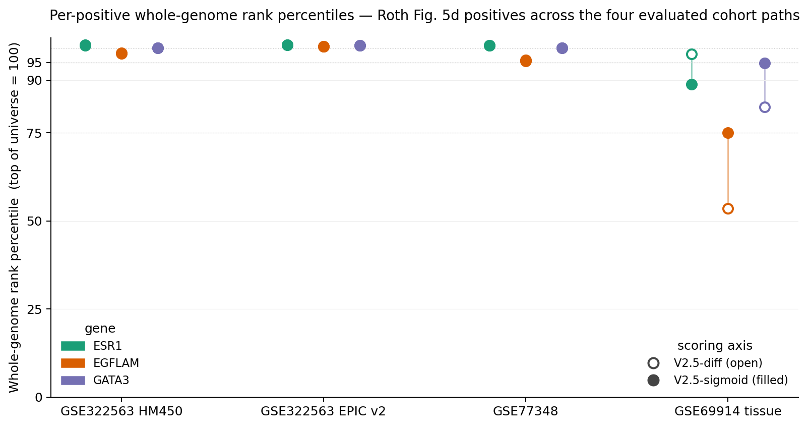

# Atlas — per-cohort ThermoCas9 target shortlists

*Hypothesis-generation only. Not a target pipeline. Read the [scope footer](#scope) before drawing any actionable conclusion from a row in this atlas.*

---

## Headline figure — per-positive whole-genome rank percentiles



For each of the three Roth Fig. 5d positives — *ESR1*, *EGFLAM*, *GATA3* — the dot-plot shows the rank percentile of that positive's PAM site within the corresponding cohort's whole-genome candidate universe (HM450 ≈ 19.8M loci; EPIC v2 ≈ 35.4M). Filled circles are V2.5-sigmoid; open circles are V2.5-diff; the line connects the two so the rank-lift direction is immediately visible.

**What to read off the plot.**

- On the three matched cell-line cohorts (left three columns), V2.5-diff and V2.5-sigmoid sit on top of each other above the 95-percentile line — AUC parity within 0.002 (PAPER.md §5.2.2 WG panel). The WG `tie_band@100` collapse from 421–1,493 records under V2.5-diff to **1** under V2.5-sigmoid is the actual usability story on these cohorts; this dot-plot only shows that the ranks are equivalent in *position*.
- On the GSE69914 tissue cohort (right column), the dumbbells stretch — and not all in the same direction. *GATA3* and *EGFLAM* improve substantially under V2.5-sigmoid; *ESR1* moves the wrong way. The ESR1 reversal is the non-uniform-superiority caveat the paper makes a point of disclosing in §6.1: in the GSE69914 `EXACT + PROXIMAL_CLOSE` restricted-universe subset (where ESR1 is the only evaluable positive), V2.5-sigmoid trails V2.5-diff, raw Δβ-only, and the limma-style baseline.

This atlas page is a different artifact from the AUC bars in fig2 (which compare V2.5-diff / V2.5-sigmoid / limma-style at the cohort-AUC level): fig4 makes the per-positive heterogeneity inside the cohort visible.

[Underlying data (JSON)](./atlas/per_positive_wg_percentile.json) · [Source: examples/genome_wide_panel.md (PAPER.md §5.2.2)](https://github.com/AllisonH12/thermocas9/blob/memo-2026-04-22-bw/examples/genome_wide_panel.md)

---

## Per-cohort top-100 shortlists

For each of the four publication cohort paths, the top 100 candidate PAM sites under V2.5-diff (`p_therapeutic_selectivity`), annotated with nearest gene, feature class, and CpG-island context. The per-cohort tables are the same artifact the paper §5.5 reports at top-20, expanded here to top-100 for the website.

| Cohort | Source | Rows | TSV (full schema) | Markdown shortlist |
|---|---|---:|---|---|
| GSE322563 HM450 | Roth MCF-7 / MCF-10A, HM450-intersect path | 100 | [top100_atlas.tsv](https://github.com/AllisonH12/thermocas9/blob/memo-2026-04-22-bw/examples/gse322563_roth_labels/top100_atlas.tsv) | [top100_atlas.md](https://github.com/AllisonH12/thermocas9/blob/memo-2026-04-22-bw/examples/gse322563_roth_labels/top100_atlas.md) |
| GSE322563 native EPIC v2 | Roth MCF-7 / MCF-10A, native EPIC v2 path | 100 | [top100_atlas.tsv](https://github.com/AllisonH12/thermocas9/blob/memo-2026-04-22-bw/examples/gse322563_native_roth_labels/top100_atlas.tsv) | [top100_atlas.md](https://github.com/AllisonH12/thermocas9/blob/memo-2026-04-22-bw/examples/gse322563_native_roth_labels/top100_atlas.md) |
| GSE77348 | δ-development cohort, n = 3/3 | 100 | [top100_atlas.tsv](https://github.com/AllisonH12/thermocas9/blob/memo-2026-04-22-bw/examples/gse77348_roth_labels/top100_atlas.tsv) | [top100_atlas.md](https://github.com/AllisonH12/thermocas9/blob/memo-2026-04-22-bw/examples/gse77348_roth_labels/top100_atlas.md) |
| GSE69914 tissue | Primary tumor (n = 305) + healthy-donor (n = 50), unpaired | 100 | [top100_atlas.tsv](https://github.com/AllisonH12/thermocas9/blob/memo-2026-04-22-bw/examples/gse69914_roth_labels/top100_atlas.tsv) | [top100_atlas.md](https://github.com/AllisonH12/thermocas9/blob/memo-2026-04-22-bw/examples/gse69914_roth_labels/top100_atlas.md) |

The combined slim-schema JSON at [`./atlas/atlas_top100.json`](./atlas/atlas_top100.json) (~200 KB, 400 rows × 15 columns) is what an interactive Astro / Observable table component should consume. The per-row schema:

```
rank · candidate_id · chrom · critical_c_pos · strand · pam_family · pam ·
score · delta_beta · p_trust · nearest_gene · tss_distance_bp ·
feature_class · cpg_island_context · is_positive
```

The `is_positive` flag identifies rows that overlap a Roth Fig. 5d positive at the wide (±500 bp) tier — a useful filter for "where do the validated positives actually land in the top 100?". RepeatMasker overlap and ENCODE DNase-HS cluster columns are intentionally omitted from the slim JSON; the per-cohort TSVs upstream still carry them as `NA`-padded columns and a v2 atlas can backfill them by re-running `scripts/build_atlas_top100.py` with `--rmsk` and `--dnase` flags wired through.

## How rows in the atlas map to rows in the paper

| Atlas surface | Paper surface |
|---|---|
| Per-positive WG-rank dot-plot (fig4) | PAPER.md §5.2.2 WG panel; data extracted from `examples/genome_wide_panel.md` |
| Per-cohort top-100 shortlists | PAPER.md §5.5 (top-20 form); these top-100 expansions ship as `examples/<cohort>_roth_labels/top100_atlas.{tsv,md}` |
| Tie-band collapse story (V2.5-diff 421–1,493 → V2.5-sigmoid 1) | PAPER.md §5.2.2 + MANUSCRIPT.md §5.6 — visible as the y-axis collapse in `docs/figures/fig2_auc_bars.png` |
| ESR1 EXACT + PROXIMAL_CLOSE restricted-universe reversal | PAPER.md §5.7; visible in fig4 above as the green dumbbell going the wrong way under V2.5-sigmoid on the tissue cohort |

## Reproducing the atlas

The two scripts that produce everything on this page:

```bash
# Per-positive dot-plot + JSON (no JSONL re-scan needed; reads
# materialized rank tables from examples/genome_wide_panel.md)
uv run python scripts/build_atlas_dotplot.py

# Per-cohort top-100 shortlists + combined JSON (~5 minutes; streams
# the four chr5/6/10 V2.5-diff scored JSONLs and joins to UCSC
# refGene + cpgIslandExt annotations)
uv run python scripts/build_atlas_top100.py
```

Both scripts source from artifacts that are committed at `memo-2026-04-22-bw` (the per-positive ranks) and reproducible from the committed build pipeline (the scored JSONLs themselves are gitignored at `data/derived/scored_*.jsonl` for size — see [the reproducibility tutorial](./06_reproducibility_tutorial.md) for the score-from-scratch recipe).

## What is *not* in this atlas (intentionally)

- **No TCGA pan-cancer rows.** The framework includes a streaming k-way-merge pan-cancer aggregator (`thermocas aggregate --streaming`), and unpublished TCGA cohort scoring exists in the working tree, but those rows are not on this website at this revision because they have not been audited against a tagged paper artifact and because publishing pan-cancer top-K shortlists on a `.com` domain reads as a drug-discovery pipeline more than a benchmarked methods demonstration. A future v2 atlas may add a TCGA section behind explicit framing.
- **No genome browser / Manhattan view.** UCSC Genome Browser already does this well; click the `candidate_id` chromosome coordinate from any TSV row to jump there.
- **No score-distribution histograms.** Those live under `examples/*_roth_labels/` as supplementary materials; this page intentionally scopes to "where do the candidates land" rather than "what does the score distribution look like."

## <a id="scope"></a>Scope footer

Every row on this page is a **candidate**, not a target. The scoring framework is open educational research — it has been benchmarked retrospectively against four public methylation cohorts, but **it has not been validated prospectively** against any wet-lab editing readout. The detailed external-validation study design is in [`docs/notes/external_validation_instruction.md`](https://github.com/AllisonH12/thermocas9/blob/memo-2026-04-22-bw/docs/notes/external_validation_instruction.md). Do not select a row from any of the top-100 tables for therapeutic application without running the full freeze-and-validate pipeline that note describes.

Roth et al., *Nature* 2026, [10.1038/s41586-026-10384-z](https://doi.org/10.1038/s41586-026-10384-z).
